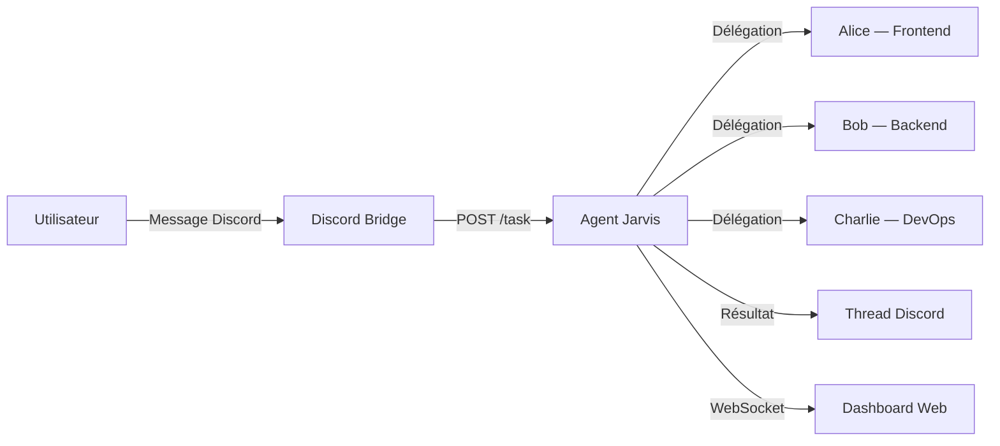
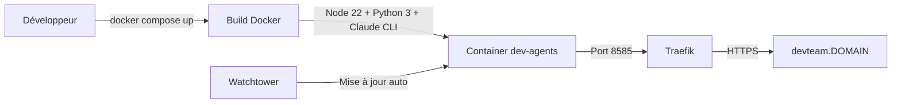

# Devteam

Equipe de développeurs IA autonome pilotée par Discord. Envoyez une demande sur le canal `#dev`, Jarvis orchestre le travail et vous livre le résultat en temps réel.

## Table des matières

- [À quoi sert ce produit ?](#à-quoi-sert-ce-produit-)
- [Fonctionnalités principales](#fonctionnalités-principales)
- [Comment ça fonctionne](#comment-ça-fonctionne)
- [Environnements](#environnements)
- [Déploiement](#déploiement)
- [Stack technique](#stack-technique)
- [Documentation complémentaire](#documentation-complémentaire)

### Documentation technique

| Document | Description |
|----------|-------------|
| [Architecture](docs/architecture.md) | Flux de données, parsing du stream JSON, gestion de la concurrence |
| [Intégration Discord](docs/discord-integration.md) | Threads, indicateur de frappe, découpage des messages, filtrage |
| [Référence API](docs/api-reference.md) | Endpoints HTTP, événements WebSocket, formats de données |

## À quoi sert ce produit ?

- **Déléguer des tâches de développement** en envoyant un simple message Discord
- **Suivre l'avancement en temps réel** via un dashboard web ou le thread Discord
- **Orchestrer plusieurs agents spécialisés** (frontend, backend, DevOps) automatiquement
- **Travailler sur vos repos git** montés depuis le NAS, sans configuration manuelle
- **Visualiser les actions des agents** (fichiers lus, modifiés, commandes exécutées)

## Fonctionnalités principales

- **Pilotage Discord** — Envoyez une demande sur `#dev`, un thread est créé automatiquement avec les mises à jour
- **Dashboard temps réel** — Interface web avec timeline, état des agents et résultat final via WebSocket
- **Agents spécialisés** — Alice (frontend), Bob (backend) et Charlie (DevOps) délégués selon le besoin
- **Exécution sécurisée** — Container isolé avec limites mémoire et pas d'escalade de privilèges
- **Suivi des coûts** — Nombre de tours et coût affiché à la fin de chaque tâche

## Comment ça fonctionne

L'utilisateur envoie une demande sur Discord. Le bridge transmet la tâche à Jarvis via l'API. Jarvis analyse la demande, délègue aux agents spécialisés si nécessaire, puis publie le résultat dans le thread Discord et le dashboard.

## Environnements

| Environnement | URL | Description |
|---------------|-----|-------------|
| Production | `https://devteam.<DOMAIN>/` | Dashboard web et API |
| Dashboard | `https://devteam.<DOMAIN>/` | Interface de suivi temps réel |
| API Health | `https://devteam.<DOMAIN>/health` | État du service (idle/busy) |

## Déploiement

Le service se déploie via Docker Compose. Le conteneur inclut Node.js, Python et Claude Code CLI. Traefik gère le routage HTTPS. Watchtower assure les mises à jour automatiques.

### Variables d'environnement requises

Créez un fichier `.env` avec les variables suivantes :

| Variable | Description |
|----------|-------------|
| `DISCORD_BOT_TOKEN` | Token du bot Discord |
| `ANTHROPIC_API_KEY` | Clé API Anthropic |
| `DOMAIN` | Domaine pour Traefik |
| `CLAUDE_MODEL` | Modèle Claude (défaut : `claude-sonnet-4-6`) |
| `MAX_TURNS` | Nombre max de tours par tâche (défaut : 50) |

## Stack technique

- **Orchestration :** Claude Code CLI (Sonnet 4.6), sous-agents avec worktrees git isolés
- **Backend :** Python 3, aiohttp (serveur HTTP + WebSocket)
- **Dashboard :** HTML/JS vanilla, WebSocket temps réel
- **Infrastructure :** Docker, Traefik, Watchtower
- **Intégration :** Discord Bot API (threads, typing indicator)

## Documentation complémentaire

- [Architecture](docs/architecture.md) — Flux de données, parsing du stream JSON, gestion de la concurrence
- [Intégration Discord](docs/discord-integration.md) — Threads, indicateur de frappe, découpage des messages
- [Référence API](docs/api-reference.md) — Endpoints HTTP, événements WebSocket, formats de données
