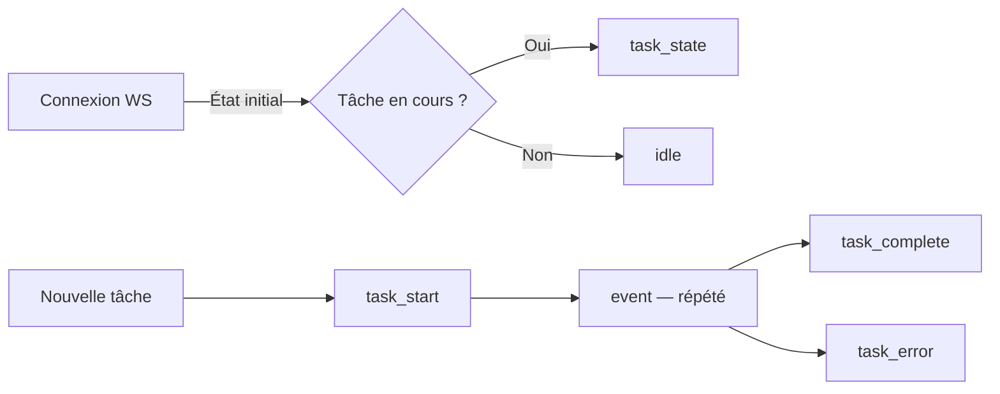

# Référence API

Ce document décrit les endpoints HTTP et les événements WebSocket du serveur Devteam. Il s'adresse aux développeurs intégrant le service ou maintenant le bridge Discord.

## Endpoints HTTP

### POST /task

Soumet une nouvelle tâche à l'agent Jarvis.

| Champ | Type | Requis | Description |
|-------|------|--------|-------------|
| `channelId` | string | oui | Identifiant du canal Discord |
| `content` | string | oui | Contenu de la demande |
| `messageId` | string | non | Identifiant du message Discord original |
| `author` | string | non | Nom de l'auteur (defaut : "unknown") |
| `threadId` | string | non | Identifiant du thread Discord pour un suivi de conversation. Si fourni et qu'une session existe pour ce thread, la conversation Claude est reprise avec le contexte precedent. |

**Réponses :**

| Code | Corps | Description |
|------|-------|-------------|
| 202 | `accepted` | Tâche acceptée et lancée en arrière-plan |
| 202 | `busy` | Une tâche est déjà en cours |

> **Détail technique**
>
> La tâche est exécutée de manière asynchrone. Le serveur répond immédiatement. Les résultats sont diffusés via WebSocket et Discord.

### GET /health

Retourne l'état du service.

**Réponse JSON :**

| Champ | Type | Description |
|-------|------|-------------|
| `status` | string | `idle` ou `busy` |
| `task` | object \| null | État de la tâche en cours (voir format ci-dessous) |

### GET /

Sert le dashboard HTML.

### GET /ws

Connexion WebSocket pour recevoir les événements en temps réel.

## Format de la tâche

L'objet tâche retourné par `/health` et diffusé via WebSocket :

| Champ | Type | Description |
|-------|------|-------------|
| `author` | string | Auteur de la demande |
| `content` | string | Contenu (tronqué à 300 caractères) |
| `status` | string | `running`, `done`, `timeout` ou `error` |
| `agents` | object | Sous-agents et leur état (`running` / `done`) |
| `events` | array | 50 derniers événements |
| `started_at` | string | Horodatage ISO de début |
| `result` | string | Résultat final (tronqué à 500 caractères) |
| `cost_usd` | number | Coût en dollars |
| `num_turns` | number | Nombre de tours Claude CLI |

## Événements WebSocket

Le serveur envoie des événements JSON via WebSocket. Voici les types possibles :

À la connexion, le serveur envoie l'état initial. Ensuite, les événements sont diffusés au fil de l'exécution.

### Types d'événements

| Type | Contenu | Quand |
|------|---------|-------|
| `idle` | — | Connexion initiale, aucune tâche |
| `task_state` | `task` | Connexion initiale, tâche en cours |
| `task_start` | `task` | Nouvelle tâche démarrée |
| `event` | `event` + `task` | Action de l'agent (outil, texte, délégation) |
| `task_complete` | `task` | Tâche terminée avec succès |
| `task_error` | `error` + `task` | Tâche échouée ou timeout |

### Sous-types d'événements (`event`)

| Sous-type | Champs | Description |
|-----------|--------|-------------|
| `agent_spawn` | `name`, `description` | Délégation à un sous-agent |
| `tool` | `tool`, `file` ou `command` | Utilisation d'un outil Claude |
| `text` | `text` | Texte de réflexion (tronqué à 200 caractères) |
| `result` | `text` | Tâche terminée |

Chaque événement contient un champ `time` au format `HH:MM:SS`.
