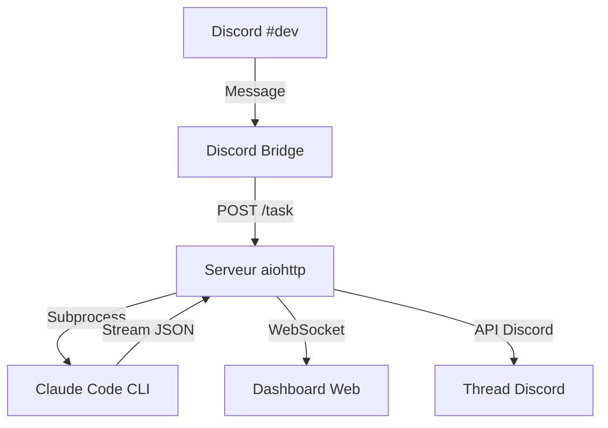
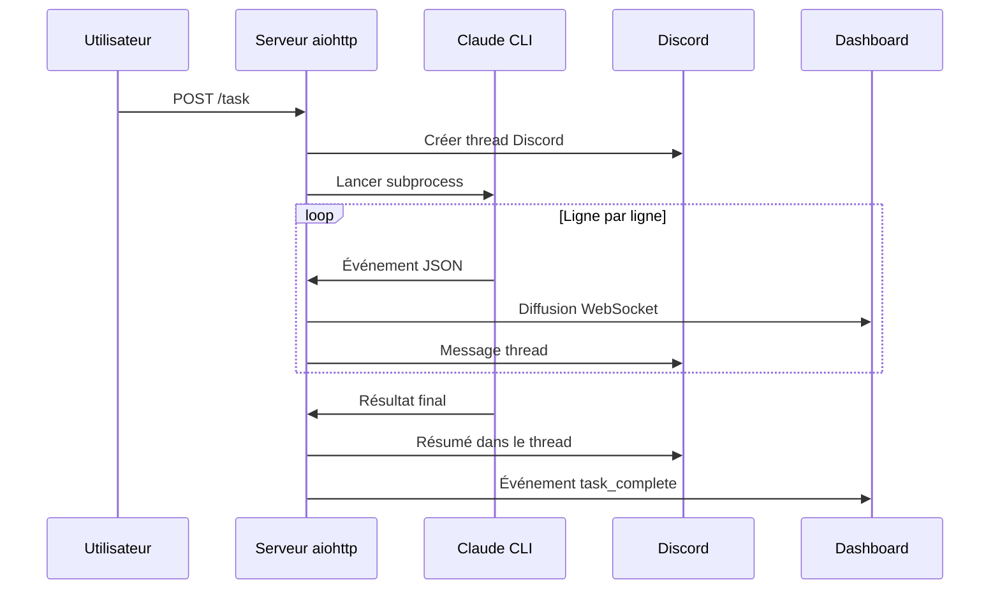

# Architecture

Vue d'ensemble de l'architecture du service Devteam. Ce document s'adresse aux développeurs et aux parties prenantes souhaitant comprendre le fonctionnement interne du système.

## Vue globale

L'utilisateur envoie un message sur Discord. Le bridge externe transmet la demande au serveur aiohttp. Ce dernier lance Claude Code CLI en subprocess, parse le flux JSON en temps réel, et diffuse les événements vers le dashboard et le thread Discord.

## Composants principaux

### Serveur HTTP (aiohttp)

- **Point d'entrée unique** : `agent.py`
- **Port** : 8585
- Gère quatre routes : `/task`, `/health`, `/ws`, `/`
- Accepte **une seule tâche à la fois** via un verrou asyncio (`_task_lock`)

### Claude Code CLI

- Lancé en **subprocess** avec `asyncio.create_subprocess_exec`
- Mode **stream JSON** (`--output-format stream-json`)
- Le flux stdout est lu ligne par ligne de manière asynchrone
- **Timeout** : 15 minutes par tâche

### Dashboard Web

- Fichier HTML unique (`dashboard.html`)
- Connexion **WebSocket** au serveur
- Reconnexion automatique toutes les 3 secondes
- Affiche la tâche en cours, les agents actifs et la timeline

## Flux de traitement d'une tâche

Le serveur reçoit la tâche, crée un thread Discord, puis lance Claude CLI. Chaque ligne du flux JSON est parsée et diffusée aux clients connectés. À la fin, le résultat est publié dans le thread et sur le dashboard.

## Parsing du stream JSON

Le flux produit par Claude CLI contient plusieurs types d'événements :

| Type | Contenu | Action |
|------|---------|--------|
| `assistant` → `tool_use` | Appel d'outil (Read, Write, Bash, Agent...) | Ajout à la timeline, notification Discord si pertinent |
| `assistant` → `text` | Texte de réflexion de l'agent | Ajout à la timeline (tronqué à 200 caractères) |
| `result` | Résultat final, coût, nombre de tours | Fin de tâche, diffusion du résultat |

> **Détail technique**
>
> Les appels `Agent` dans le stream permettent de détecter les sous-agents (Alice, Bob, Charlie). Leur état est suivi dans `task.agents` et affiché sur le dashboard.

## Gestion de la concurrence

- **Une seule tâche simultanée** — le verrou `_task_lock` bloque les demandes concurrentes
- Les demandes reçues pendant une tâche reçoivent une réponse HTTP 202 avec le message "busy"
- L'indicateur de frappe Discord (`typing`) est maintenu actif pendant toute la durée de la tâche

## État de la tâche

La classe `TaskState` centralise l'état d'une tâche en cours :

| Champ | Description |
|-------|-------------|
| `status` | `running`, `done`, `timeout` ou `error` |
| `agents` | Dictionnaire des sous-agents et leur état |
| `events` | 50 derniers événements (timeline) |
| `cost_usd` | Coût total de la tâche |
| `num_turns` | Nombre de tours Claude CLI |
| `result` | Résultat final (tronqué à 500 caractères pour le dashboard) |
