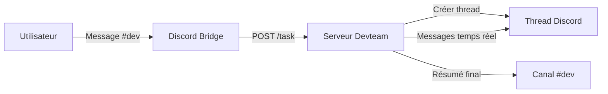

# Intégration Discord

Ce document décrit comment Devteam interagit avec Discord. Il s'adresse aux développeurs maintenant le service et aux utilisateurs souhaitant comprendre le comportement du bot.

## Vue d'ensemble

Un bridge externe (non inclus dans ce repo) surveille le canal `#dev`. Lorsqu'un message est détecté, il envoie une requête HTTP au serveur Devteam. Le serveur crée un thread et y publie les mises à jour.

## Cycle de vie d'une tâche

1. **Réception** — Le bridge envoie `POST /task` avec le contenu, l'auteur et l'identifiant du message
2. **Création du thread** — Un thread Discord est créé sur le message original (archivage auto après 24h)
3. **Indicateur de frappe** — Le bot maintient le "typing" actif pendant toute l'exécution
4. **Mises à jour** — Les événements importants sont postés dans le thread :
   - Délégation à un sous-agent (Alice, Bob, Charlie)
   - Écriture ou modification de fichier
   - Commandes significatives (git, npm, docker, test, build)
5. **Résultat** — Le résumé est posté dans le thread avec le coût et le nombre de tours
6. **Notification canal** — Un message court est posté dans `#dev` avec un lien vers le thread

## Découpage des messages

Discord limite les messages à 2000 caractères. Le serveur découpe automatiquement les messages longs :

- **Limite** : 1950 caractères par chunk (marge de sécurité)
- **Découpage intelligent** : coupe au dernier saut de ligne avant la limite
- **Fallback** : si aucun saut de ligne n'est trouvé dans la seconde moitié, coupe à la limite exacte
- Le premier chunk conserve la référence au message original (reply)

## API Discord utilisée

| Action | Endpoint Discord | Usage |
|--------|-----------------|-------|
| Envoyer un message | `POST /channels/{id}/messages` | Résultats, mises à jour |
| Créer un thread | `POST /channels/{id}/messages/{id}/threads` | Thread par tâche |
| Indicateur de frappe | `POST /channels/{id}/typing` | Toutes les 8 secondes |

## Filtrage des événements

Tous les événements ne sont pas postés dans le thread Discord. Voici la logique de filtrage :

| Type d'événement | Posté dans le thread ? |
|------------------|----------------------|
| Délégation agent | Oui — toujours |
| Écriture/modification fichier | Oui — nom du fichier affiché |
| Commande Bash significative | Oui — si contient `git`, `npm`, `docker`, `test` ou `build` |
| Lecture de fichier | Non — trop fréquent |
| Texte de réflexion | Non — réservé au dashboard |

## Configuration requise

- **Token bot Discord** — Variable `DISCORD_BOT_TOKEN`
- **Permissions du bot** — Envoyer des messages, créer des threads, lire l'historique
- **Bridge externe** — Non inclus dans ce repo, doit envoyer `POST /task` au serveur
